# AI Interview Coach

This project is a multi-agent system built with Google ADK that conducts personalized technical mock interviews by analyzing your resume and target job description.

### Problem Statement

Preparing for technical interviews is an overwhelming and often lonely process. Candidates struggle to objectively assess their skills against specific job requirements, leading to "imposter syndrome" or blind spots in their knowledge. Traditional preparation methods—static lists of "Top 100 Interview Questions" or generic coding platforms—lack the nuance of a real conversation. They don't simulate the pressure of follow-up questions, nor do they provide the personalized, constructive feedback necessary to improve. Hiring a human career coach is expensive, and asking friends for mock interviews can be awkward or logistically difficult.

### Solution Statement

Agents are the perfect solution for technical interviewing because an interview is inherently a dynamic, multi-turn interaction, not a static task. Unlike a rigid script, an AI agent possesses the adaptability to listen to a candidate's answer, detect partial understanding, and ask targeted follow-up questions to dig deeper—mimicking the nuance of a real interviewer.

Furthermore, a single LLM prompt often struggles to balance conflicting personas, such as being a "tough evaluator" versus a "helpful guide." By utilizing a multi-agent system, we can achieve role specialization: one agent focuses purely on rigorous technical assessment, while another handles supportive mentorship and resource gathering. Finally, agents excel at contextual awareness, maintaining state across a long session to remember previous answers, inconsistencies, and growth, which allows for a comprehensive and personalized final critique.

### Architecture



I built `interview_coach`, a sophisticated multi-agent system designed to simulate a real-world technical interview loop. The architecture leverages the **Google Agent Development Kit (ADK)** to orchestrate a team of specialized agents:

**1. The Orchestrator (`root_agent`)**
The entry point of the system. It handles the initial "handshake," checking if the user's resume is already in long-term memory or asking for a new file and job description URL. It then triggers the preparation pipeline.

**2. The Preparation Pipeline (`setup_pipeline`)**
A `SequentialAgent` that prepares the interview context before the user even answers the first question:

- **The Researcher (`dossier_agent`):** Uses custom tools (`scrape_job_offer`, `read_resume_pdf`) to analyze the target Job Description and the candidate's Resume. It compiles a "Candidate Dossier" that highlights skill gaps and key requirements. It also handles long-term memory persistence, ensuring the user's profile is saved for future sessions using custom tools (`save_profile`, `load_profile`).
- **The Hiring Manager (`questions_agent`):** Reads the dossier and generates a set of tailored, high-impact technical questions specific to the role and the candidate's experience.

**3. The Interview Workflow (`interview_workflow`)**
A custom agent that manages the active interview loop:

- **The Conductor (`interview_conductor_agent`):** The "face" of the interview. It asks questions one by one, evaluates the user's response, and decides whether to accept the answer, ask a follow-up, or provide a hint. It maintains the professional persona of an interviewer.
- **The Critic (`critic_agent`):** Runs only after the interview concludes. It acts as a "Bar Raiser" or Career Coach. It analyzes the entire conversation history to identify technical weaknesses. Crucially, it delegates to a **Google Search Agent** to find the single best, up-to-date learning resource for every identified gap, compiling a "Recommended Learning Path" for the user.

### The Build

This project was built using the Google Agent Development Kit (ADK) and Python.

- Model: Powered by Gemini for high-quality reasoning and persona management.
- Tools:
  - Custom Tools: BeautifulSoup for scraping job descriptions, pypdf for extracting resume text, and a file-based JSON system for Long-Term Memory (persisting user profiles).
  - Built-in Tools: Google Search for finding live learning resources.
- State Management: Utilized `InMemorySessionService` to maintain conversation history and explicit state keys (`candidate_dossier`, `questions`, `interview_status`) to coordinate data flow between specialized agents.

### Value Statement

The AI Interview Coach democratizes access to high-quality career preparation. It saves candidates hours of time normally spent searching for relevant interview questions and vetting learning resources. Instead of generic advice, users get a hyper-personalized study plan based on their actual performance gaps.

For me personally, this tool bridges the gap between "knowing the code" and "communicating the solution." It provides a safe, judgment-free environment to fail and learn, ensuring that when the real interview comes, the candidate is not just prepared, but confident.

### Possible Improvements

**Voice Integration**: I would add Speech-to-Text and Text-to-Speech capabilities to allow users to practice verbal communication, which is a huge part of interview success.

**Code Execution Environment**: I would integrate a sandbox tool so the agent could ask the user to write actual code (e.g., "Write a function to reverse a linked list") and run it to verify correctness.

### Installation

This project was built using **Python 3.10+** and manages dependencies with `uv`.

1.  **Clone the repository:**

    ```bash
    git clone git@github.com:404brtk/ai-interview-coach.git
    cd ai-interview-coach
    ```

2.  **Install dependencies:**
    ```bash
    uv sync
    ```

### Running the Agent

**Option 1: ADK Web Interface (Recommended)**
To run the agent with the visual debugger and chat interface:

```bash
uv run adk web
```

**Option 2: CLI Mode**
To run the agent directly in the terminal:

```bash
uv run run.py
```

### Project Structure

The project is organized as follows:

- `interview_coach/`: The main package containing agent logic.
  - `agent.py`: Defines the `root_agent` and orchestrates the high-level pipeline.
  - `sub_agents/`: Specialized agents for specific phases.
    - `dossier_agent.py`: Researches the job and resume.
    - `questions_agent.py`: Generates technical questions.
    - `interview_agent.py`: Conducts the interactive interview.
    - `critic_agent.py`: Performs the final evaluation and resource search.
  - `tools.py`: Custom tools for scraping, PDF reading, and memory management.
  - `custom_agents.py`: Contains `InterviewWorkflowAgent` for custom control flow.
  - `agent_utils.py`: Helper functions and callbacks (`check_completion_callback`).
  - `config.py`: Configuration settings (e.g., model selection).
- `run.py`: The entry point for the console application.

### Workflow

The `root_agent` follows this execution flow:

1.  **Initialization**: Checks if a resume is already stored in `user_profile.json`. If not, it requests a PDF file and a Job URL.
2.  **Preparation Pipeline (`setup_pipeline`)**:
    - **Dossier Generation**: `dossier_agent` scrapes the job description and parses the resume to create a "Candidate Dossier" mapping skills to requirements.
    - **Question Generation**: `questions_agent` uses the dossier to formulate specific technical questions.
3.  **Interview Loop (`interview_workflow`)**:
    - **Conduction**: `interview_conductor_agent` asks questions one-by-one, evaluating answers and providing hints if necessary.
    - **Completion**: Detects when the interview is finished.
4.  **Critique & Learning (`critic_agent`)**:
    - **Analysis**: Reviews the entire conversation history.
    - **Resource Search**: Identifies knowledge gaps and uses Google Search to find specific learning resources.
    - **Report**: Outputs a final performance summary and learning path.
